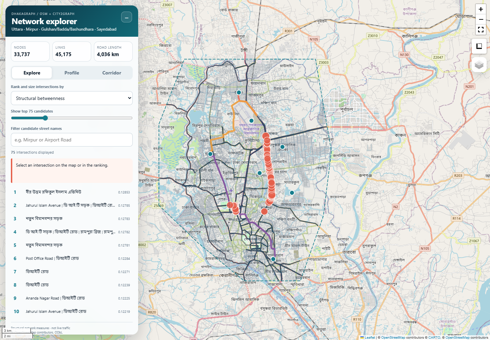
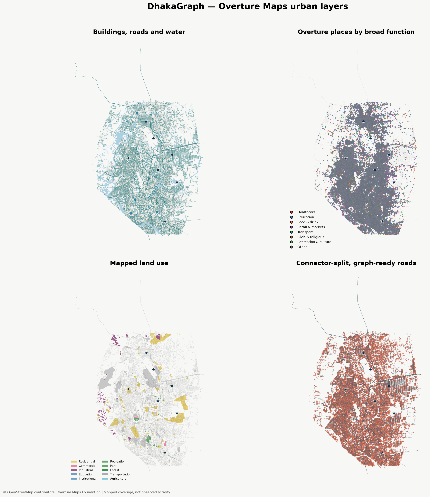
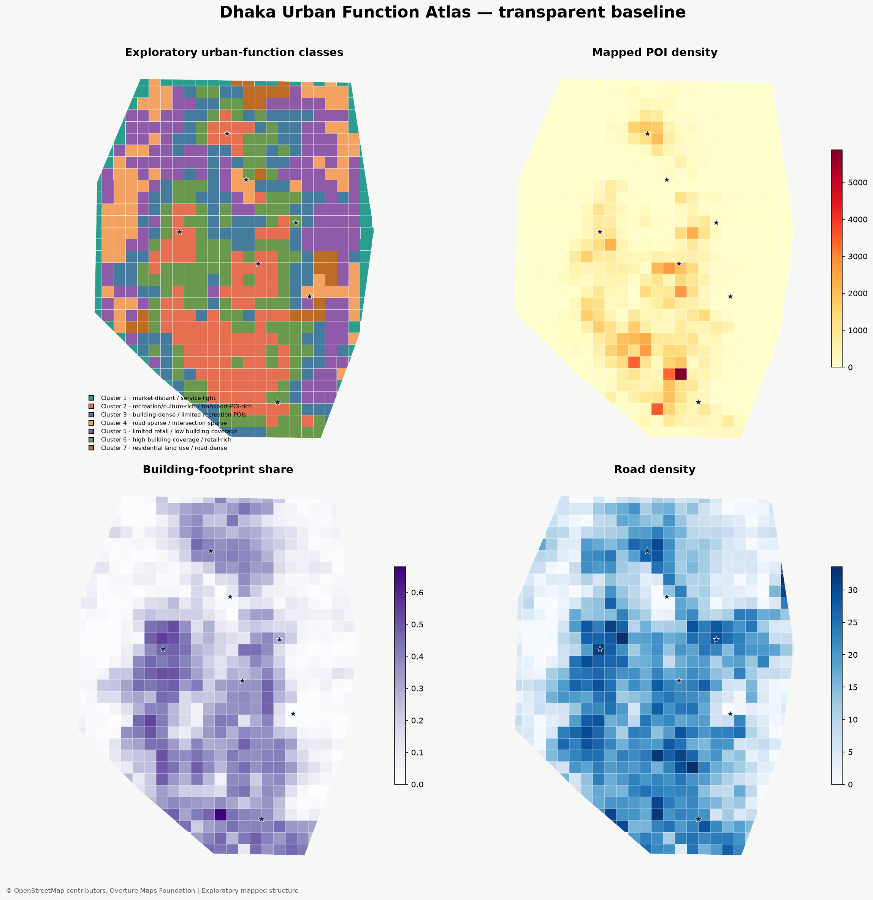
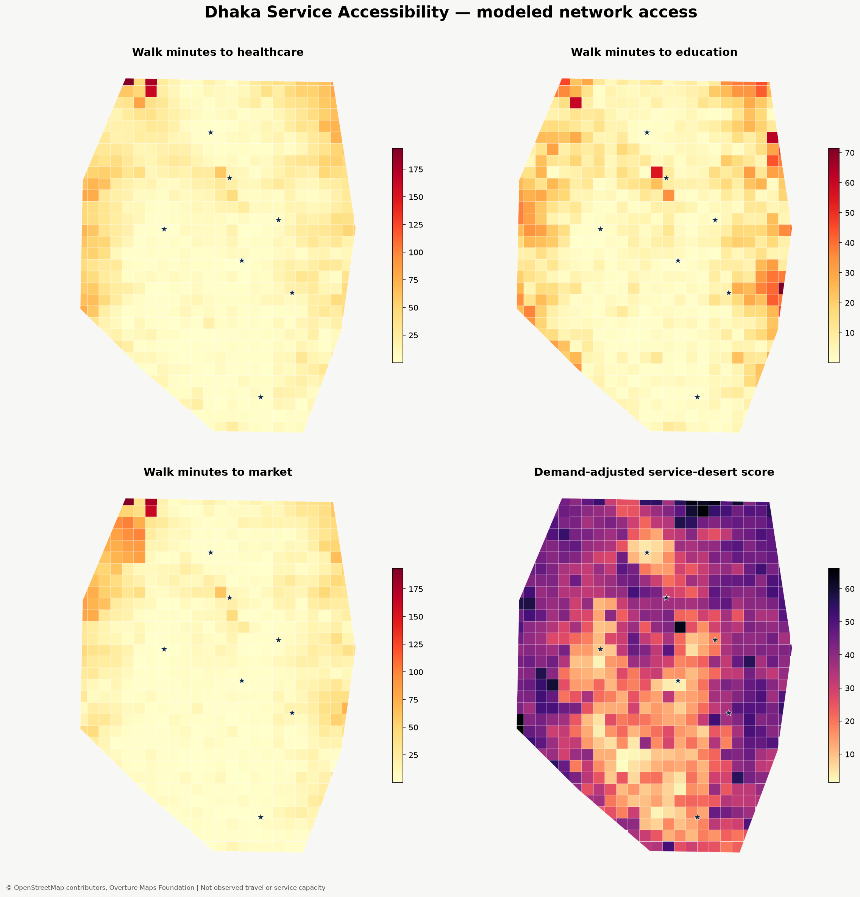

# DhakaGraph

[](https://emam26.github.io/DhakaGraph/outputs/maps/network_explorer.html)

**[Open the live road graph](https://emam26.github.io/DhakaGraph/outputs/maps/network_explorer.html)** |
**[Explore Overture Maps](https://emam26.github.io/DhakaGraph/outputs/maps/overture_explorer.html)** |
**[Explore the urban atlas](https://emam26.github.io/DhakaGraph/outputs/maps/urban_atlas.html)** |
**[Explore service access](https://emam26.github.io/DhakaGraph/outputs/maps/service_accessibility.html)** |
**[Explore flood scenarios](https://emam26.github.io/DhakaGraph/outputs/maps/flood_simulation.html)** |
**[Explore service equity](https://emam26.github.io/DhakaGraph/outputs/maps/population_equity.html)** |
**[Explore mobility pressure](https://emam26.github.io/DhakaGraph/outputs/maps/mobility_pressure.html)**

DhakaGraph is a fun, learning-oriented study of Dhaka as a spatial graph. It
asks what the mapped road network, buildings, places, land use, and services
can tell us about how different parts of the city are structured and served.

This is not a live-traffic system and it does not claim to measure actual
footfall, road usage, population, or service quality.

## Study area

The expanded study covers Airport and Uttara in the north, Sayedabad in the
south, Mirpur to the west, and Gulshan, Badda, and Bashundhara to the east.
The fixed polygon represents approximately **337.7 km2**. The study combines
OpenStreetMap road data with an Overture Maps snapshot from release
`2026-07-22.0`.

See [the study-area definition](docs/STUDY_AREA.md) and
[the data-source notes](docs/DATA_SOURCES.md).

## Explore the findings

| Road network | Overture urban layers |
| --- | --- |
| [](https://emam26.github.io/DhakaGraph/outputs/maps/network_explorer.html) | [](https://emam26.github.io/DhakaGraph/outputs/maps/overture_explorer.html) |
| [Open the network explorer](https://emam26.github.io/DhakaGraph/outputs/maps/network_explorer.html) | [Open the Overture explorer](https://emam26.github.io/DhakaGraph/outputs/maps/overture_explorer.html) |

| Urban function atlas | Service accessibility |
| --- | --- |
| [](https://emam26.github.io/DhakaGraph/outputs/maps/urban_atlas.html) | [](https://emam26.github.io/DhakaGraph/outputs/maps/service_accessibility.html) |
| [Open the urban atlas](https://emam26.github.io/DhakaGraph/outputs/maps/urban_atlas.html) | [Open the service-accessibility explorer](https://emam26.github.io/DhakaGraph/outputs/maps/service_accessibility.html) |

## What the outputs show

### 1. Road network structure

The OSM-based graph contains **33,737 nodes**, **84,161 directed edges**, and
one connected component across the study area. It represents approximately
**4,036 km of structural road length**. The network explorer and centrality map
show degree, sampled betweenness, road classes, named roads, anchor areas, and
ranked intersections.

The highest-ranked roads and intersections are structurally important in the
mapped network. They are not automatically the roads people use most.

### 2. Mapped urban coverage

The Overture snapshot contains:

- **566,618** building footprints
- **109,582** place features
- **51,663** road segments
- **2,423** land-use features
- **3,194** water features

The Overture explorer lets you compare building coverage, roads, places,
land-use classes, water, and requested Dhaka anchors. These are mapped-feature
counts, not counts of people, visits, or traffic.

### 3. Urban function atlas

The atlas divides the study area into **643 clipped cells of 750 m** and
describes recurring combinations of mapped buildings, places, roads,
intersections, land use, and service locations.

The seven exploratory cell patterns are:

- market-distant / service-light
- recreation/culture-rich / transport-POI-rich
- building-dense / limited recreation POIs
- road-sparse / intersection-sparse
- limited retail / low building coverage
- high building coverage / retail-rich
- residential land use / road-dense

These are descriptive clusters, not official neighborhood boundaries or
ground-truth land-use classes.

### 4. Service access and service deserts

The accessibility explorer estimates walking time from each cell to mapped
education, healthcare, market, park, and transport facilities. The median
nearest-service times are:

| Service | Median nearest time | 90th-percentile time |
| --- | ---: | ---: |
| Education | 5.4 min | 25.1 min |
| Market | 7.2 min | 38.5 min |
| Transport POI | 10.3 min | 50.4 min |
| Healthcare | 10.4 min | 43.7 min |
| Park | 13.6 min | 43.1 min |

The service-desert table highlights cells with relatively long nearest-service
times and fewer facilities within the modeled 15-minute range. It is a useful
screening result for asking where access appears weaker in the mapped data; it
is not a population-weighted equity measure.

### 5. Neighborhood similarity

The similarity explorer lets you choose Airport, Uttara, Mirpur, Gulshan,
Badda, Bashundhara, or Sayedabad as a reference and find cells elsewhere with
a similar mapped profile. The comparison uses building intensity, road and
intersection structure, POI mix, land use, network centrality, and modeled
service access.

This is useful for asking questions such as: which other parts of Dhaka look
like a high-building, retail-rich area, or where are there places with a
similar structure but weaker service access? Similarity is a feature-profile
comparison, not a claim of social, cultural, or demographic equivalence.

### 6. Flood-resilience scenarios

The flood simulation tests how the connector-split road graph changes under
modeled water levels of 0.5, 1.0, 1.5, 2.0, and 3.0 m. At the 1.5 m scenario,
the current proxy marks **9.5% of graph edges** as inundated; at 2.0 m it marks
**22.5%**, and at 3.0 m it marks **54.8%**. Anchor-pair connectivity falls from
15/21 at the lower scenarios to 6/21 at 2.0 m and 0/21 at 3.0 m.

These are sensitivity scenarios based on a distance-to-water elevation proxy.
They are useful for testing network fragility, but they are not measured flood
depths or an official forecast. Historical flood products should be added before
using the results for planning decisions.

### 7. Population-weighted service equity

The equity explorer weights service access by mapped built and residential
intensity, then reports population-weighted walking times and the share of the
weighted area within 15 minutes of each service. With the current proxy, the
estimated weighted shares within 15 minutes are **88.6% for education**, **83.4%
for markets**, **77.1% for transport POIs**, **74.4% for healthcare**, and **65.8%
for parks**.

This is a better prioritization screen than an unweighted average, but it is
not yet census-population weighting. The pipeline accepts an optional
`data/raw/urban/population_cell_weights.csv` file with `cell_id,population` to
replace the proxy when a validated gridded population source is available.

### 8. Modeled mobility pressure

The mobility explorer routes a deterministic weighted sample of **6,372
origin-destination pairs** through the largest Overture road component. Origins
are weighted by mapped building and residential intensity; destinations are
weighted by mapped POI, market, transport, healthcare, and education density.

The pressure score highlights roads and intersections that repeatedly appear in
modeled routes. It is a useful network-bottleneck experiment and a candidate
guide for traffic-count collection, but it is not measured traffic volume or
proof of the most-used roads.

## Published maps and previews

| File | What it contains |
| --- | --- |
| [`centrality_map.html`](outputs/maps/centrality_map.html) | Static-style interactive map of structural centrality. |
| [`centrality_preview.png`](outputs/maps/centrality_preview.png) | Full-size preview of the centrality map. |
| [`network_explorer.html`](outputs/maps/network_explorer.html) | Main interactive road-network dashboard. |
| [`network_explorer_desktop.png`](outputs/maps/network_explorer_desktop.png) | README thumbnail for the road graph. |
| [`overture_explorer.html`](outputs/maps/overture_explorer.html) | Interactive Overture buildings, roads, places, land use, and water. |
| [`overture_preview.png`](outputs/maps/overture_preview.png) | Four-panel Overture coverage preview. |
| [`urban_atlas.html`](outputs/maps/urban_atlas.html) | Interactive 750 m urban-function atlas with switchable metrics. |
| [`urban_atlas_preview.png`](outputs/maps/urban_atlas_preview.png) | Static atlas preview. |
| [`service_accessibility.html`](outputs/maps/service_accessibility.html) | Interactive walking-access and service-desert explorer. |
| [`service_accessibility_preview.png`](outputs/maps/service_accessibility_preview.png) | Static service-accessibility preview. |
| [`neighborhood_similarity.html`](outputs/maps/neighborhood_similarity.html) | Interactive reference-neighborhood similarity explorer. |
| [`neighborhood_similarity_preview.png`](outputs/maps/neighborhood_similarity_preview.png) | Static similarity preview for four reference areas. |
| [`flood_simulation.html`](outputs/maps/flood_simulation.html) | Interactive modeled flood-level road-disruption map. |
| [`flood_simulation_preview.png`](outputs/maps/flood_simulation_preview.png) | Static comparison of four flood scenarios. |
| [`population_equity.html`](outputs/maps/population_equity.html) | Interactive population-weighted service-equity explorer. |
| [`population_equity_preview.png`](outputs/maps/population_equity_preview.png) | Static equity-gap and population-weight preview. |
| [`mobility_pressure.html`](outputs/maps/mobility_pressure.html) | Interactive modeled origin-destination pressure map. |
| [`mobility_pressure_preview.png`](outputs/maps/mobility_pressure_preview.png) | Static preview of high-pressure modeled roads. |

## Published tables and summaries

| File | What it contains |
| --- | --- |
| [`network_summary.json`](outputs/tables/network_summary.json) | Main network size, connectivity, study-area, and attribution summary. |
| [`network_profile.json`](outputs/tables/network_profile.json) | Extended road-network profile and graph statistics. |
| [`top_intersections.csv`](outputs/tables/top_intersections.csv) | Ranked structurally important intersections. |
| [`overture_summary.json`](outputs/tables/overture_summary.json) | Overture feature counts, road totals, POI groups, and land-use summary. |
| [`overture_layer_audit.csv`](outputs/tables/overture_layer_audit.csv) | Coverage and geometry audit for each Overture layer. |
| [`overture_poi_categories.csv`](outputs/tables/overture_poi_categories.csv) | Mapped place-category counts. |
| [`overture_land_use_classes.csv`](outputs/tables/overture_land_use_classes.csv) | Mapped land-use-class counts. |
| [`urban_atlas_summary.json`](outputs/tables/urban_atlas_summary.json) | Cell count, cluster descriptions, feature interpretation, and method summary. |
| [`urban_atlas_cells.csv`](outputs/tables/urban_atlas_cells.csv) | One row per 750 m cell with urban-function features and cluster labels. |
| [`service_accessibility_summary.json`](outputs/tables/service_accessibility_summary.json) | Facility totals, walking-time statistics, assumptions, and limitations. |
| [`service_accessibility_cells.csv`](outputs/tables/service_accessibility_cells.csv) | One row per cell with modeled access times and facility counts. |
| [`service_deserts.csv`](outputs/tables/service_deserts.csv) | Cells ranked by the demand-adjusted service-gap score. |
| [`neighborhood_similarity_cells.csv`](outputs/tables/neighborhood_similarity_cells.csv) | One row per cell with similarity scores for all seven anchors. |
| [`neighborhood_similarity_rankings.csv`](outputs/tables/neighborhood_similarity_rankings.csv) | Top ten matching cells for each reference neighborhood. |
| [`neighborhood_similarity_summary.json`](outputs/tables/neighborhood_similarity_summary.json) | Feature list, anchor-cell matches, method, and interpretation notes. |
| [`flood_cascade_summary.json`](outputs/tables/flood_cascade_summary.json) | Modeled flood scenarios, connectivity changes, assumptions, and caveats. |
| [`vulnerable_roads.csv`](outputs/tables/vulnerable_roads.csv) | Road edges ranked by repeated inundation across modeled scenarios. |
| [`population_equity_cells.csv`](outputs/tables/population_equity_cells.csv) | Cell-level weights, service gaps, walking times, and 15-minute access. |
| [`population_equity_rankings.csv`](outputs/tables/population_equity_rankings.csv) | Highest equity-gap cells by service type. |
| [`population_equity_summary.json`](outputs/tables/population_equity_summary.json) | Weighted service statistics, source label, and interpretation limits. |
| [`mobility_pressure_top.csv`](outputs/tables/mobility_pressure_top.csv) | Ranked modeled pressure roads and route counts. |
| [`intersection_pressure_top.csv`](outputs/tables/intersection_pressure_top.csv) | Ranked modeled pressure intersections. |
| [`mobility_pressure_summary.json`](outputs/tables/mobility_pressure_summary.json) | Graph, route-sampling, proxy, and interpretation summary. |

## Run the project

The repository also includes small command-line entry points for reproducing
the pilot outputs:

```powershell
dhakagraph-pilot
dhakagraph-overture
dhakagraph-urban
dhakagraph-flood
dhakagraph-equity
dhakagraph-mobility
```

For environment setup and reproducibility notes, see
[docs/DATA_SOURCES.md](docs/DATA_SOURCES.md) and
[docs/ROADMAP.md](docs/ROADMAP.md).

## Important interpretation limits

- Centrality is a graph-structure signal, not observed road usage.
- Overture and OpenStreetMap counts describe mapped coverage, which can be
  incomplete or uneven across neighborhoods.
- Walking times use a modeled speed and mapped road connections; they do not
  include sidewalk quality, crossings, congestion, service capacity, or
  population.
- Public transit is not modeled because this snapshot does not include a
  validated Dhaka GTFS feed.
- Flood, morphology, and GNN modules are exploratory code for future study
  extensions; their results are not yet part of the published output snapshot.

OpenStreetMap-derived outputs retain attribution to
[OpenStreetMap contributors](https://www.openstreetmap.org/copyright) under the
Open Database License. Overture outputs retain Overture Maps Foundation
attribution and the pinned release identifier above.
