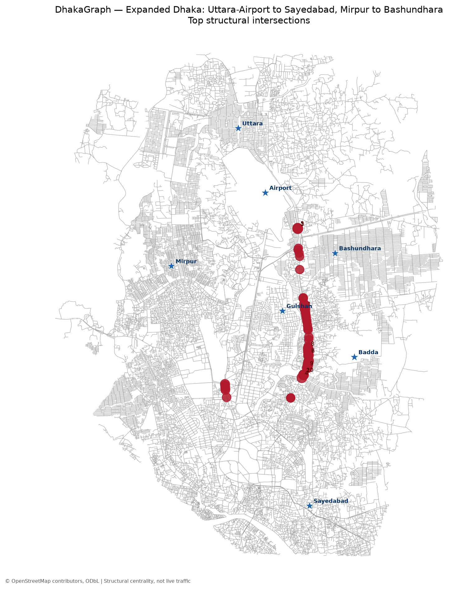

# DhakaGraph

DhakaGraph is a learning-oriented exploration of Dhaka as a spatial graph. The
project begins with roads and intersections, then adds places, public transport,
and flood scenarios as the underlying data are audited.

The default milestone builds a drive network across a fixed polygon from Uttara
and the Airport south to Sayedabad, with Mirpur included to the west. It converts
the network through City2Graph, calculates structural network metrics, and writes
an interactive map. These metrics describe map connectivity; they are not
measurements of live Dhaka traffic.

## Current milestone

- Download and cache the expanded north-south Dhaka road graph.
- Convert the OSMnx graph through City2Graph.
- Measure graph size, connectivity, and approximate node betweenness.
- Export ranked intersections, a summary, processed spatial layers, and an HTML map.
- Keep all network-dependent work outside the unit tests.

## Setup on Windows

City2Graph 1.0 requires Python 3.12 through 3.14. This machine has Python 3.14
available, so use a separate environment rather than the Python 3.11 GIFT
environment.

```powershell
py -3.14 -m venv .venv
.\.venv\Scripts\Activate.ps1
python -m pip install --upgrade pip
python -m pip install -e ".[dev]"
```

## Run the pilot

```powershell
dhakagraph-pilot
```

Useful options:

```powershell
dhakagraph-pilot --centrality-samples 200 --top-n 40
dhakagraph-pilot --refresh
dhakagraph-pilot --area shahbag --radius 1500
```

The default `expanded` area uses a checked-in polygon that contains Airport,
Uttara, Mirpur, and Sayedabad anchors. The original 2.5 km Shahbag pilot remains
available with `--area shahbag`. The first run needs internet access to query
OpenStreetMap; later runs reuse the cached GraphML file unless `--refresh` is
supplied. See [docs/STUDY_AREA.md](docs/STUDY_AREA.md) for the boundary definition.

## Outputs

The latest expanded Dhaka pilot snapshot is available online:

- [Explore the dynamic network dashboard](https://emam26.github.io/DhakaGraph/outputs/maps/network_explorer.html)
- [Open the interactive centrality map](https://emam26.github.io/DhakaGraph/outputs/maps/centrality_map.html)
- [View the full-size static map](outputs/maps/centrality_preview.png)
- [Read the network summary](outputs/tables/network_summary.json)
- [Read the extended network profile](outputs/tables/network_profile.json)
- [Browse the ranked intersections](outputs/tables/top_intersections.csv)

The dynamic explorer provides switchable betweenness/degree rankings, a visible-node
slider, street-name filtering, selectable intersections, topology sketches,
degree and road-class charts, named-road summaries, anchor focus controls, and an
illustrative Uttara-Airport-Mirpur-Sayedabad shortest-distance graph connection.



```text
data/raw/airport_uttara_mirpur_sayedabad_drive.graphml
data/processed/airport_uttara_mirpur_sayedabad_nodes.geojson
data/processed/airport_uttara_mirpur_sayedabad_edges.geojson
outputs/tables/network_summary.json
outputs/tables/network_profile.json
outputs/tables/top_intersections.csv
outputs/maps/centrality_map.html
outputs/maps/network_explorer.html
outputs/maps/centrality_preview.png
```

The four linked result artifacts are versioned as a reproducible pilot snapshot;
the downloaded and processed geospatial datasets remain ignored by Git.
OpenStreetMap-derived outputs retain attribution: © OpenStreetMap contributors,
available under the Open Database License.

## Roadmap

See [docs/ROADMAP.md](docs/ROADMAP.md) for the staged plan and
[docs/DATA_SOURCES.md](docs/DATA_SOURCES.md) for data-source rules.
